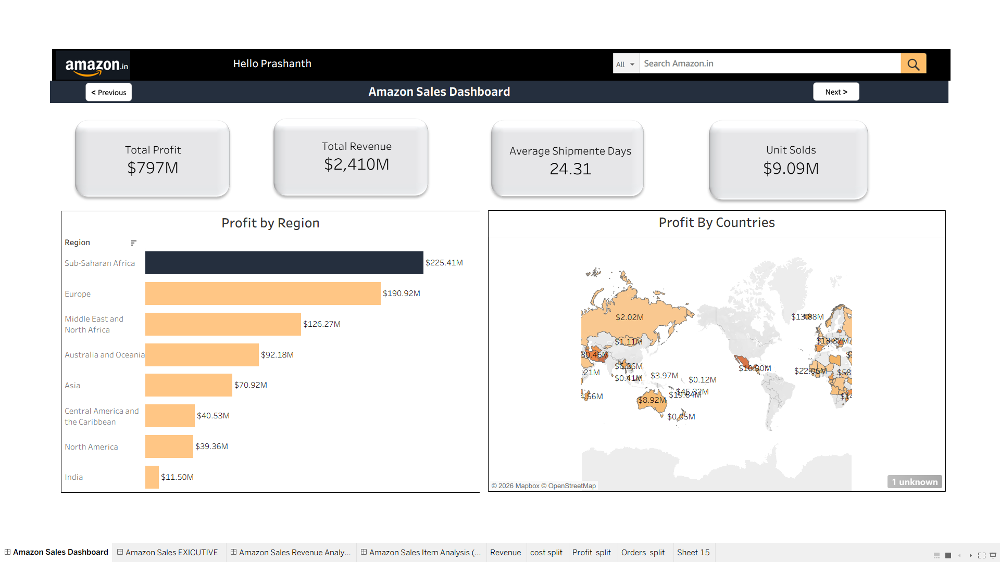
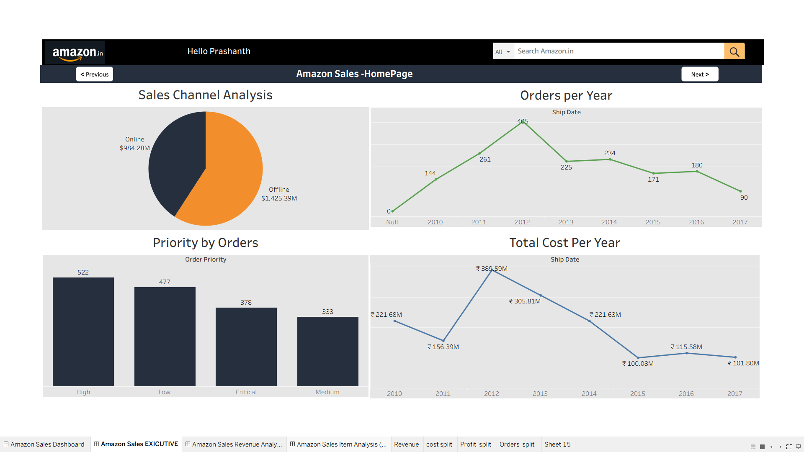
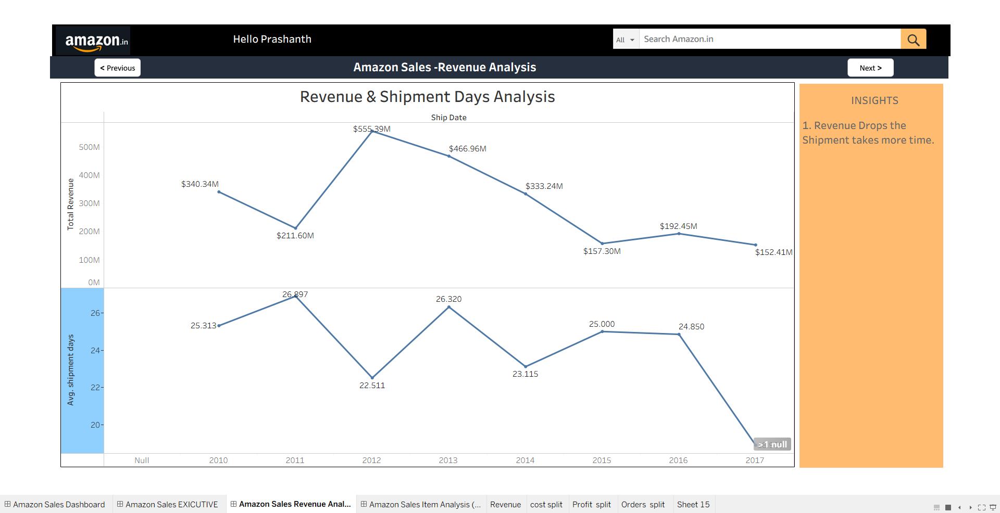
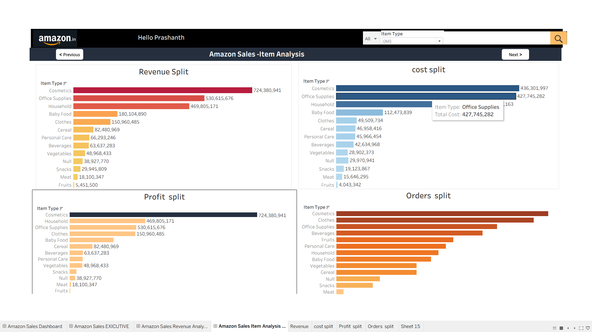

# Amazon Sales Dashboard | Tableau

An interactive, 4-page Tableau dashboard that analyses Amazon sales performance across revenue, profit, cost, orders, shipment time, regions, countries, sales channels and item types.

## Project Objective
Give business stakeholders a quick view of **how much we sell, where we make profit, which products drive revenue, and how shipping time relates to revenue.**

## Key Business Questions
1. What are the total revenue, profit, units sold and average shipment days?
2. Which regions and countries generate the most profit?
3. Which item types drive revenue, cost and orders?
4. How do revenue and orders change year over year?
5. Does a longer shipment time affect revenue?
6. Which sales channel (online vs offline) performs better?

## Tools Used
- **Tableau Public / Tableau Desktop**: dashboards, KPI cards, navigation buttons
- **Dataset**: Amazon sales data (Item Type, Region, Country, Sales Channel, Order Priority, Ship Date, Units Sold, Revenue, Cost, Profit)

## Dashboard Pages

| # | Page | What it shows |
|---|------|---------------|
| 1 | Sales Dashboard | KPI cards, Profit by Region, Profit by Countries (map) |
| 2 | Executive Homepage | Sales Channel split, Orders per Year, Priority by Orders, Total Cost per Year |
| 3 | Revenue Analysis | Revenue and Average Shipment Days by year, with insight |
| 4 | Item Analysis | Revenue, Cost, Profit and Orders split by Item Type, with Item Type filter |

### 1. Sales Dashboard

### 2. Executive Homepage

### 3. Revenue & Shipment Analysis

### 4. Item Analysis

## Key Insights
- **Total revenue $2,410M** and **total profit $797M** (about 33% profit margin), with **9.09M units** sold and an **average shipment time of 24.31 days**.
- **Offline sales lead:** $1,425.39M (about 59%) vs Online $984.28M (about 41%).
- **Revenue peaked in 2012** at $555.39M, then declined to $152.41M by 2017. Orders followed the same pattern (405 orders in 2012 down to 90 in 2017).
- **Sub-Saharan Africa is the most profitable region** ($225.41M), followed by Europe ($190.92M). India is the lowest ($11.50M).
- **Cosmetics is the top revenue item** ($724.38M), followed by Office Supplies ($530.62M) and Household ($469.81M). Cosmetics and Office Supplies also carry the highest cost.
- **Order priority:** High (522) and Low (477) orders are the largest groups.
- **Shipment time:** the year with the lowest average shipment days (2012, 22.5 days) is also the highest-revenue year, suggesting faster delivery goes with higher revenue.

## Dashboard Features
- Navigation buttons (Previous / Next) between pages
- Amazon-style header with search bar
- Item Type filter on the Item Analysis page
- Tooltips on charts
- KPI cards for quick numbers

## How to Open This Project
1. Open the **Tableau Public** link below, or
2. Download the `.twbx` file from the `tableau/` folder and open it in Tableau Desktop / Tableau Public.

**Live dashboard:** `ADD YOUR TABLEAU PUBLIC LINK HERE`

## Repository Structure

Amazon-Sales-Dashboard-Tableau/
├── README.md
├── images/
│   ├── 01-amazon-sales-dashboard-overview.png
│   ├── 02-executive-homepage.png
│   ├── 03-revenue-shipment-analysis.png
│   └── 04-item-analysis.png
├── tableau/
│   └── amazon-sales-dashboard.twbx
└── data/
    └── amazon-sales-data.csv

## Skills Demonstrated
Data visualisation, KPI design, dashboard storytelling, dashboard navigation, filters and tooltips, business insight writing.

## Author
**Prashanth Udidi**
Senior Quality Analyst | Aspiring Data Analyst
[LinkedIn](https://www.linkedin.com/in/prashanth-udidi-1ba598336) | [GitHub](https://github.com/udidiprashanth-alt)

